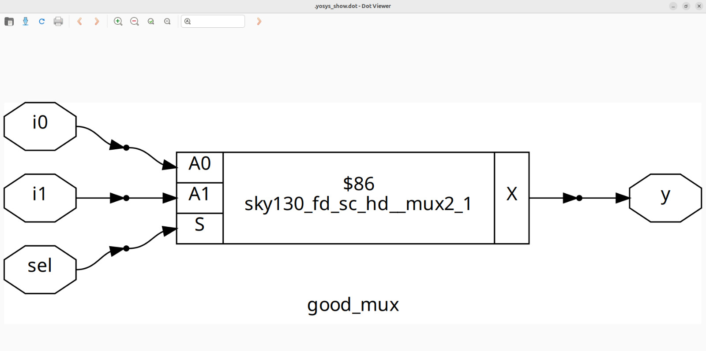
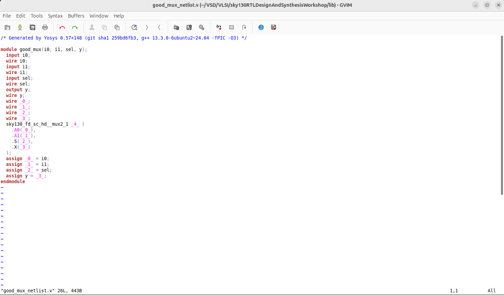

# 4. Labs using Yosys & Sky130 PDK

In this final subdivision of Day 1, I performed **hands-on labs using Yosys** along with the **Sky130 PDK** to synthesize and realize a simple MUX design. The lab was divided into three parts.  

---

## What I Learned
During this session, I understood:
- How to load a standard cell library in Yosys using `read_liberty`.  
- How to import an RTL Verilog design using `read_verilog`.  
- The synthesis flow in Yosys from RTL to intermediate representation using `synth`. 
- How to write the synthesized gate-level netlist using `write_verilog`. 
- Importance of organizing commands and outputs to track the synthesis process.  


---

## 🔹 Part 1: Reading Library and Synthesizing RTL

1. **Read the library file (.lib)** using the command:  
```bash
read_liberty -lib <path_to_library_file>
``` 

- <path_to_library_file> can be a relative or absolute path.  
- This loads the standard cell definitions into Yosys.

**Screenshot:** Terminal showing `read_liberty` command output 


---

## Read the Verilog module

```bash
read_verilog good_mux.v
```
- Loads the RTL design into Yosys. 

**Screenshot:** Terminal showing `read_verilog` output  


---

## Synthesize the design

```bash
synth -top good_mux
```
- Converts the RTL to an intermediate representation.

**Screenshot:** Terminal showing synthesis output 


---

## Perform technology mapping with ABC

```bash
abc -liberty < path_to_library_file >
```
- Generates the **gate-level netlist** from the RTL.

**Screenshot:** Terminal showing ABC output  


---

## Visualize the synthesized logic

- The command that Produces a graphical representation of the logic.
```bash
show
```

**Screenshot:** Terminal Output


--- 

**Screenshot:** Graphical logic representation



---

## Part 2: Realization of MUX in Gates

### Write the netlist to a file

```bash
write_verilog -noattr good_mux_netlist.v
```
- The **-noattr** option removes extra attributes for cleaner output.
- The file name should be meaningful to maintain clarity in the repository.

**Screenshot:** Terminal showing write verilog output


---

### Open and Inspect the Netlist

```bash
gvim good_mux_netlist.v
```
- Opens the generated netlist in gvim.
- Allows checking how the RTL design is translated into gate-level logic.

 **Screenshot**: gvim showing gate-level netlist


