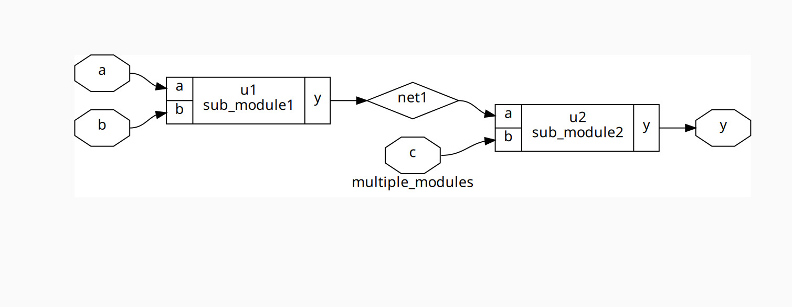
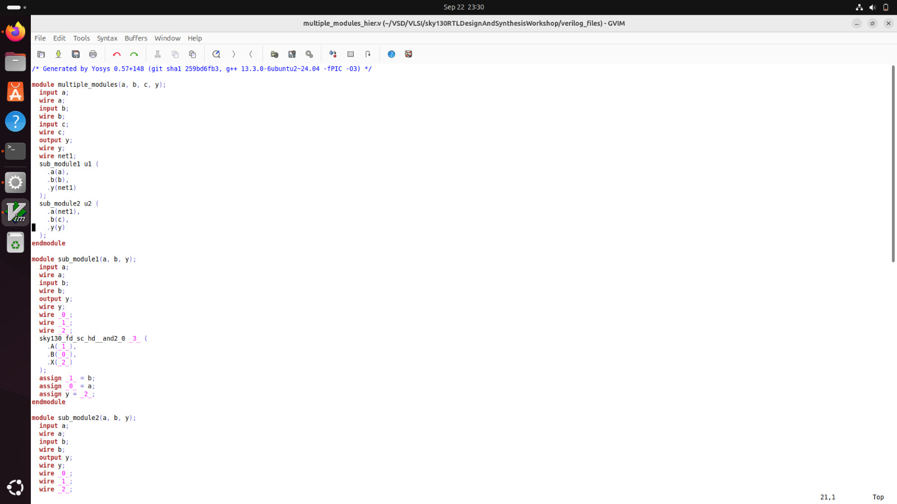

# 2. Hierarchical vs Flat Synthesis

---

## What I Learned

- I explored the difference between **Hierarchical** and **Flat Synthesis** approaches in digital design.  
- I practiced synthesizing a **multi-module design** and observed how the **hierarchy affects the resulting netlist structure**.  
- I learned that **Hierarchical Synthesis** preserves module structure, improving **readability and modular verification**.  
- I learned that **Flat Synthesis** merges all modules into a **single top-level module**, enabling **global optimization** but reducing readability.  
- I understood how **submodule-level (modulable) synthesis** allows synthesizing specific modules for **large designs** or **repeated modules**.  


---

## Key Concepts

### Hierarchical Synthesis
- In **Hierarchical Synthesis**, each module is synthesized **separately** according to the design hierarchy.  
- Maintains the module structure in the netlist, which improves **readability** and **modular verification**.  
- Preferred when designs have **multiple instances of the same module** or when we want a **divide-and-conquer approach** to handle large designs.  

###  Flat Synthesis
- In **Flat Synthesis**, all modules are **flattened into a single top-level module** during synthesis.  
- Maximizes **global optimization** but can result in a **large, less readable netlist**.  
- Useful for smaller designs or when **module hierarchy is not required**.

### Modulable / Submodule-level Synthesis
- Allows synthesizing **only specific submodules** using:  
```bash
synth -top <module_name>
```

### Example – Hierarchical Synthesis Flow

For the design (`multiple_modules.v`), I executed the following commands:

```bash
read_liberty -lib ../lib/sky130_fd_sc_hd__tt_025C_1v80.lib
read_verilog multiple_modules.v
synth -top multiple_modules 
abc -liberty ../lib/sky130_fd_sc_hd__tt_025C_1v80.lib
show multiple_modules
write_verilog -noattr multiple_modules_hier.v
!gvim multiple_modules_heir.v
```

**Screenshot:** Graphical representation of multiple_modules



---

**Screenshot:** hierarchical Netlist file



---
### Observation

- After synthesis, the hierarchy is maintained, and the structure clearly shows submodules

---

### Example – Flat Synthesis Flow

To flatten the design:

```bash
write_verilog -noattr multiple_modules_flat.v
!gvim multiple_modules_flat.v
```

**Screenshot:** Flat Netlist file


---

### Observations:

- All modules are merged into a single file.
- No hierarchy is preserved.
- Useful for global optimization, but harder to read.

---

## Key Takeaways

- **Hierarchical Synthesis** keeps module structure intact, aiding **readability**, **modular verification**, and **divide-and-conquer synthesis**.  
- **Flat Synthesis** merges all modules for **maximum optimization** but sacrifices readability.  
- **Submodule-level (modulable) synthesis** allows control over which modules to synthesize, helpful in **large designs** or **repetitive modules**.
