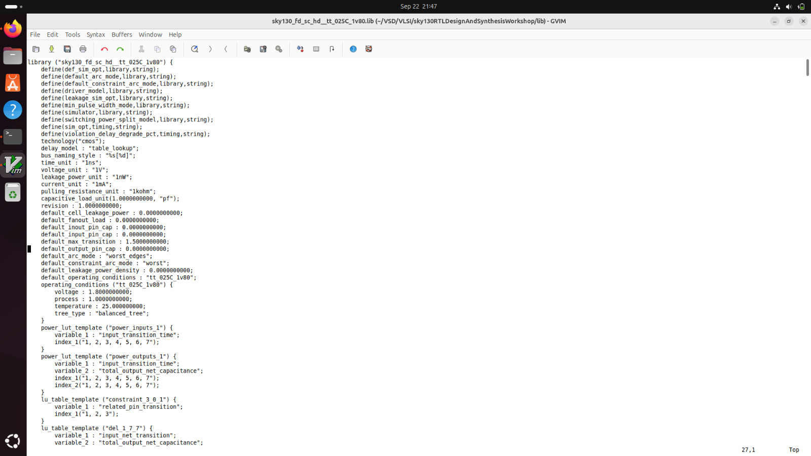
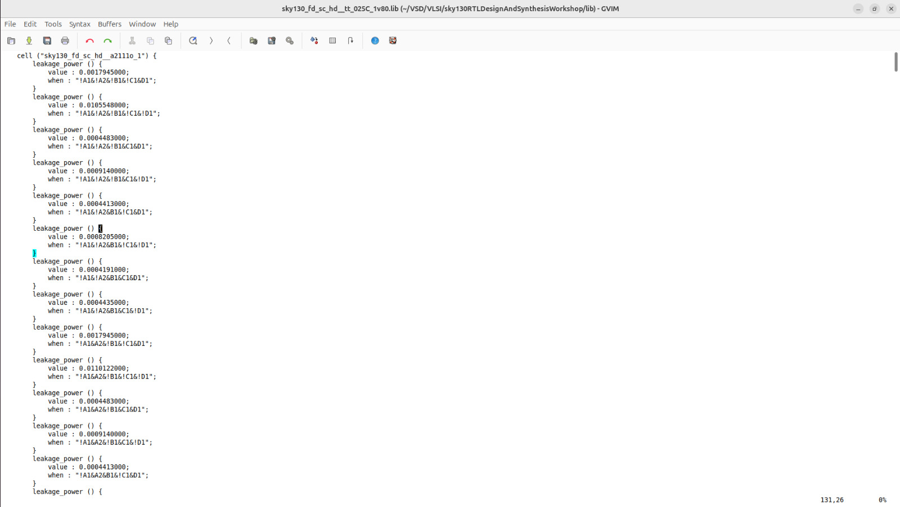

# 1. Introduction to Timing .Libs  
---

## What I Explored  

- For this topic, I worked with the **Sky130 RTL library** provided in Kunal Ghosh sir GitHub repo.  
- I explored the **timing library files**, looked into their contents, and understood how they describe standard cells,leekage power,area etc. 

---

## Key Learnings  

### Library Naming Convention  

The name of the library itself encodes three important factors:  

`sky130_fd_sc_hd__tt_025C_1v80.lib`  

- **TT** → Typical process  
- **025C** → Temperature = 25°C  
- **1v80** → Voltage = 1.8V  

These three (Process, Voltage, Temperature) are critical for a silicon chip to function reliably.  

**Analogy:**  
Think of **toasting bread** — every time you toast it, the result is slightly different.  
In the same way, **fabrication introduces variations** in silicon.  
A chip must still work across all such corners.  

**Screenshot:** sky130 library file






---

### 2️⃣ Exploring Cells in the Library  

The library contains **buckets of cells** like:  
- AND, OR, NAND, NOR,  
- Inverters, Buffers, etc.  

I also analyzed the **equivalent Verilog models** of these cells.  

### Command used to analyse verilog model:  
```bash
:sp < relative_path >/behavioral.v
```

## Example – Analyzing an AND Cell  

I specifically opened an **AND2 cell** and explored details like leakage power, etc.  

### command Used:  

```bash
:sp < relative_path > /sky130_fd_sc_hd__a2111o.behavioral.v
```

### Comparing Different AND Cell Variants  

I compared three variants: **AND2_0, AND2_2, AND2_4**.  

| Cell Name | Area (Relative) | Speed    | Notes                            |
|-----------|-----------------|----------|----------------------------------|
| AND2_0    | Smallest        | Slowest  | Less area, higher delay          |
| AND2_2    | Medium          | Balanced | Trade-off between area and delay |
| AND2_4    | Largest         | Fastest  | Wider transistors, less delay    |

**Key Insight:**  
- Larger area → faster cells (due to wider transistors).  
- Smaller area → slower cells (but area-efficient).  

**Screenshot:** Comparision of different flavours of **AND** cells


 

## Wrap-Up  

From this lecture, I understood:  

- How **PVT variations** are captured in library file names.  
- How to view the **equivalent Verilog models** of cells.  
- **different cell variants trade off like area and performance**.  

This gave me a strong foundation on how timing libraries drive the **behavior, area, and delay characteristics** of standard cells.  

