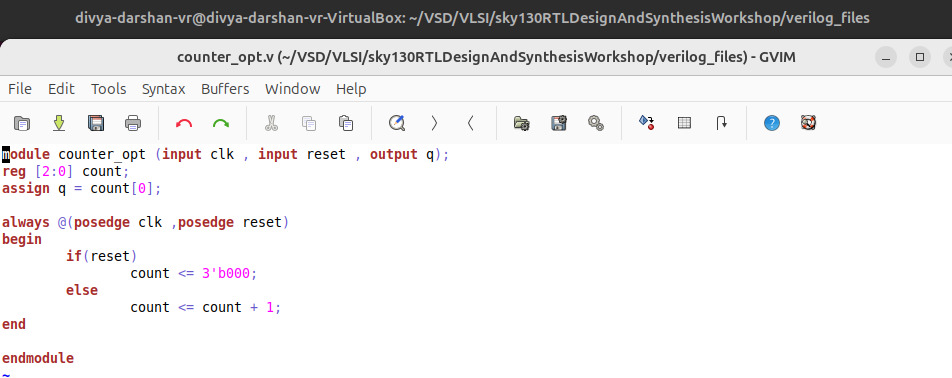
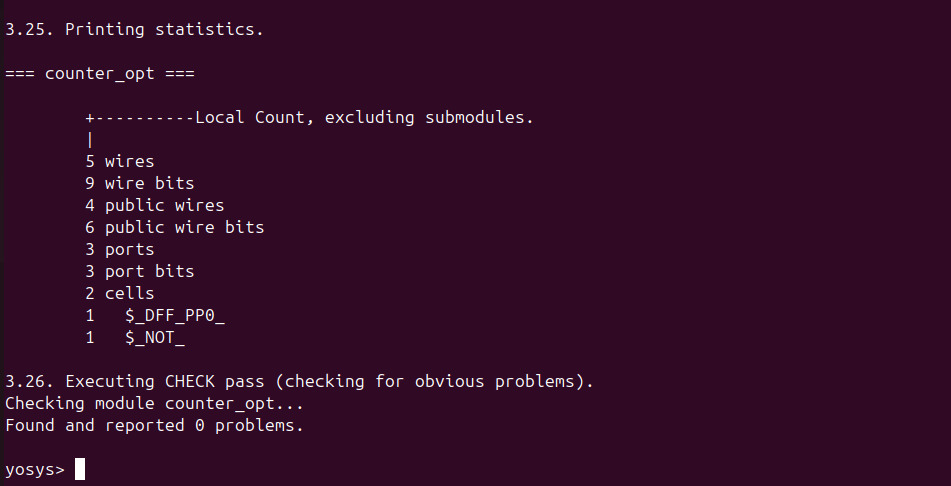
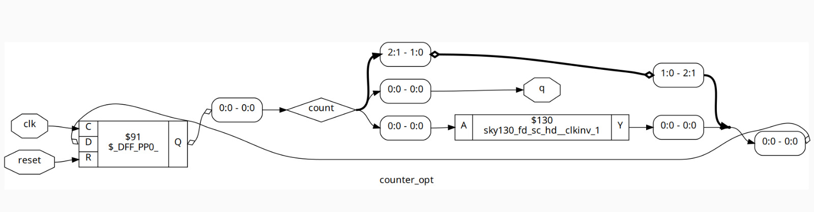
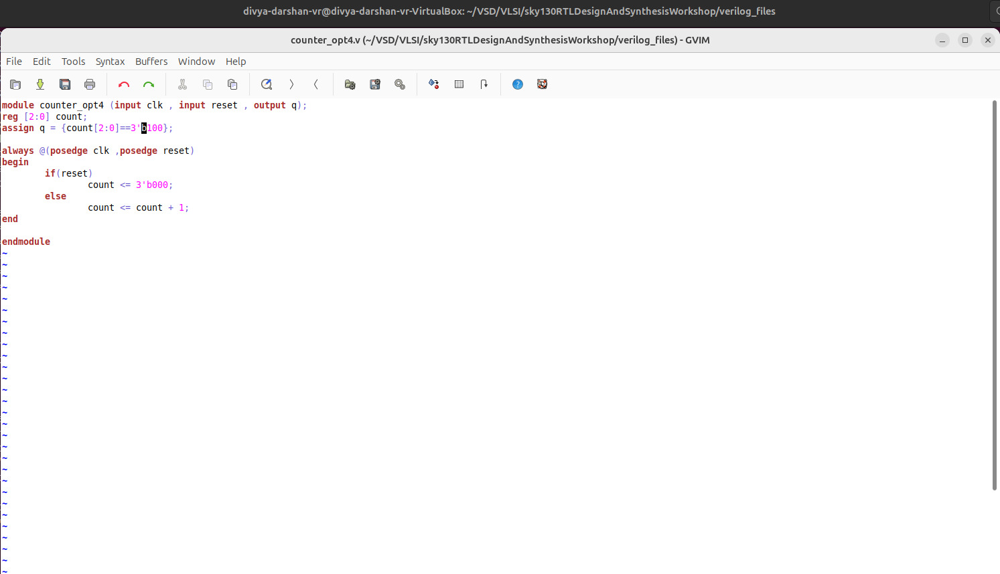
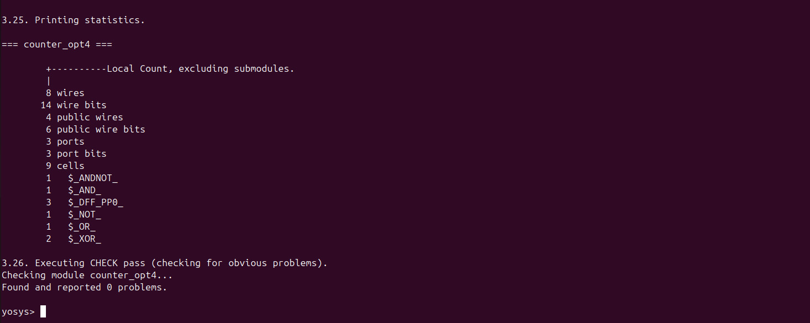
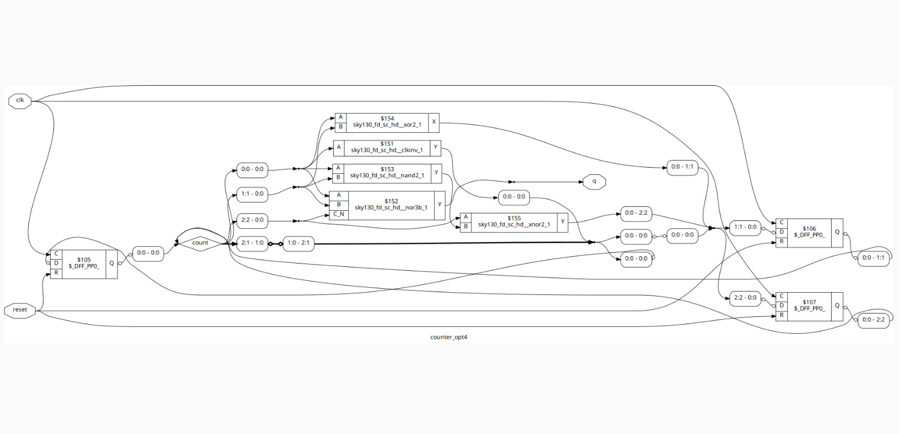

# 4. Sequential Optimization for Unused Outputs

In this subdivision, I focused on **unused output optimization** in sequential circuits.  
I analyzed a **counter module** to observe how synthesis tools optimize unused flip-flop outputs.

---

##  File Analyzed

- **counter_opt.v** – 3-bit counter used for analysis.

I performed **Verilog simulation**, **code analysis**, and **synthesis**, and studied the graphical representation to understand how unused outputs are handled.

---

##  counter_opt.v

### Case 1 – Only LSB Used

- **Observation:**  
  - The counter’s output depends **only on the LSB (count_0)**.  
  - The MSB bits are **unused**.  
  - Synthesizer optimized the design to a **single flip-flop with an inverter**, removing the redundant MSB flip-flops.  

- **Key Learnings:**  
  - Sequential optimization can remove unused outputs, saving area and reducing power.  
  - Even if a module has multiple flip-flops, only the **essential logic** is retained after optimization.  

- **Screenshot: Verilog Module** 

    

  ---

- **Screenshot: Synthesis Statistics**  

  

  ---

- **Screenshot: Graphical Representation**  

    

---

### Case 2 – All Outputs Used

- **Observation:**  
  - The counter output is **100**, meaning all three flip-flops are utilized.  
  - Synthesizer **did not perform any optimization** since all outputs are necessary.  

- **Key Learnings:**  
  - Unused output optimization only occurs when certain outputs are redundant or unconnected.  
  - Tools retain all flip-flops if all outputs are functional and necessary.  

- **Screenshot: Verilog Module**  

   

  ---

- **Screenshot: Synthesis Statistics**  

    

  ---

- **Screenshot: Graphical Representation**  

    

---

##  Overall Key Learning from This Subdivision

- Sequential optimization tools can **detect unused outputs** and remove redundant flip-flops.  
- Optimizing unused outputs reduces **area, power, and routing congestion**.  
- It’s important to identify which outputs are actually used in your design to help the synthesis tool optimize efficiently.

---