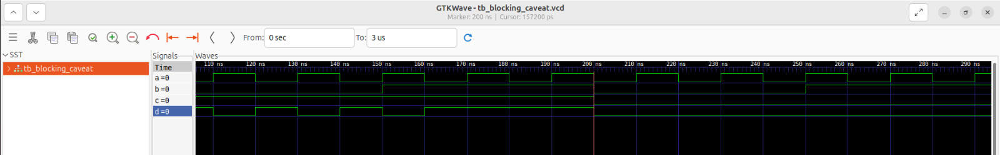
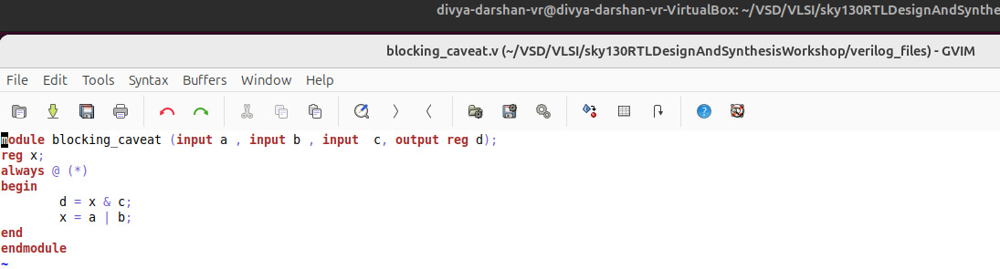

# 3. Labs on Synthesis-Simulation Mismatch for Blocking Statements

In this final subdivision of Day 4, we explored **synthesis-simulation mismatches caused by blocking assignments**.  

We used the Verilog module:

- `blocking_caveat.v` – a combinational logic circuit combining **AND** and **OR** gates.

---

## 1. Lab Procedure

1. **RTL Simulation**  
   - Simulated `blocking_kv8.v` at the RTL level.  
   - Verified logical behavior of the combinational circuit.  
   - Observed the waveform and identified how **blocking assignments** affect signal updates.  

2. **Synthesis & GLS Simulation**  
   - Synthesized the design to generate the **gate-level netlist**.  
   - Ran **GLS** to simulate the synthesized netlist.  
   - Compared GLS waveform with RTL simulation to identify mismatches.  

---

## 2. Observations

- In RTL simulation:  
  - Some signals depended on **older values** of other variables due to blocking assignments (`=`).  
  - This behavior sometimes **mimics flip-flops**, even in combinational logic.  

- In GLS simulation:  
  - The synthesized design performed correctly according to hardware logic.  
  - A clear **synthesis-simulation mismatch** was observed between RTL and GLS waveforms.  

- **Lesson:**  
  - Blocking assignments in combinational logic can introduce **unexpected sequential behavior** in RTL simulation.  
  - GLS is necessary to confirm the **actual hardware functionality**.  

---

## 3. Screenshots

**1. RTL Simulation Waveform:** 

**2. GLS Simulation Waveform:**  

**3. Verilog Code Screenshot:**  

---
