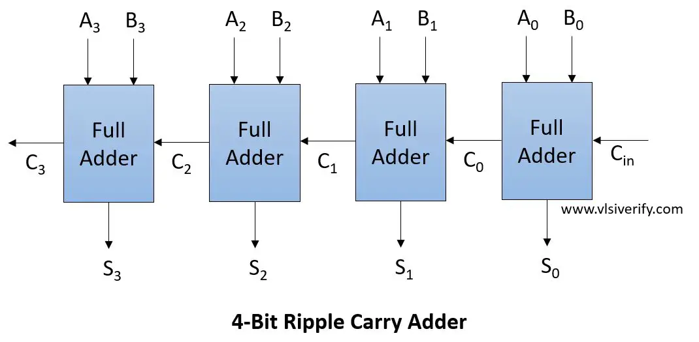

# 4. For-Loops and For-Generate

This document explains the fourth subdivision of **Day 5 - Optimization in Synthesis**.  
In this section, we studied the two looping constructs in Verilog: **for-loops** and **generate for-loops**.

---

## Types of Looping Constructs
1. **For Loop**  
   - Always used **inside an `always` block**.  
   - Mainly for evaluating expressions or iterating over conditions.  
   - Cannot instantiate hardware.  
   - Example use case: creating logic for **MUX/DEMUX**.  

2. **Generate For Loop**  
   - Used **outside of the `always` block**.  
   - Specifically meant for **instantiating hardware** multiple times.  
   - Very useful when the same module needs to be repeated.  
   - Example use case: **Ripple Carry Adder**, where multiple full adders are instantiated.  

---

## Syntax

### For Loop (inside always block)
```verilog
always @(*) begin
  integer i;
  for (i = 0; i < N; i = i + 1) begin
    // Expression evaluation logic
  end
end
```

### Generate For Loop (outside always block)
```verilog
genvar i;
generate
  for (i = 0; i < N; i = i + 1) begin : label_name
    module_name instance_name (...);
  end
endgenerate
```
#### Example: Ripple Carry Adder with Generate For

- Suppose we want to design an 8-bit ripple carry adder. Instead of instantiating 8 full adders manually, we can use a generate for-loop:

```verilog
genvar i;
generate
  for (i = 0; i < 8; i = i + 1) begin : adder_stage
    full_adder FA (.a(A[i]), .b(B[i]), .cin(carry[i]), .sum(S[i]), .cout(carry[i+1]));
  end
endgenerate
```

- Here, the full adder module is instantiated 8 times automatically.
- This saves repetitive coding and ensures clean, scalable hardware design.

**Screenshot** of 4-bit Ripple carry adder:



---

## Observations

- **For Loops:** Good for behavioral modeling inside always blocks.
- **Generate For Loops:** Best for structural modeling and hardware replication.
- Both are essential in writing scalable and reusable Verilog code.
- What I Learned
- There are two distinct looping constructs in Verilog: for and generate for.
- A for loop is useful for expressions and logic evaluation but cannot replicate hardware.
- A generate for loop is used for hardware replication, making designs like ripple-carry adders simple and scalable.
- Using generate constructs avoids repetitive instantiations and leads to cleaner code.
- The difference between the two is crucial for both simulation and synthesis optimization.

---

## For vs Generate For

| Aspect            | For Loop (inside always)               | Generate For Loop (outside always)        |
|-------------------|-----------------------------------------|-------------------------------------------|
| Location          | Used inside an `always` block          | Used outside `always`, in `generate` block |
| Purpose           | Expression evaluation / behavioral logic | Hardware instantiation / structural logic  |
| Hardware Creation | Does not instantiate hardware          | Can instantiate multiple hardware modules  |
| Common Use Cases  | MUX, DEMUX, iterative expressions      | Ripple Carry Adder, array of modules       |
| Flexibility       | Simulation-oriented                   | Synthesis-oriented, scalable hardware      |
| Example           | Looping for signal assignment          | Repeated instantiation of full adders      |

---