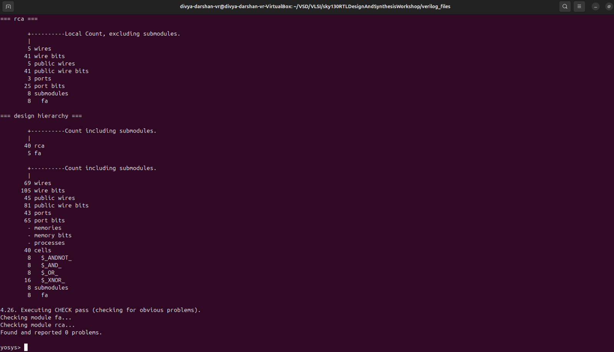

# Day 5 – Subdivision 5: Labs on For Loop and For Generate

In this final subdivision of **Day 5**, we analyzed the use of **`for` loop** and **`for-generate` constructs** in Verilog.  

---

We explored the following modules:  

1. **mux_generate.v** – Multiplexer design using generate statement  
2. **demux_generate.v** – Demultiplexer design using generate statement  
3. **demux_case.v** – Demultiplexer design using case statement  
4. **fa.v** – Full Adder module  
5. **rca.v** – Ripple Carry Adder (RCA), implemented by instantiating multiple Full Adders  

For each, we performed:  
- **RTL coding** in Verilog  
- **Simulation** to verify functionality  
- **Synthesis** to check hardware mapping  

---

## Full Adder (FA)

### RTL Code of Full Adder

---

## Ripple Carry Adder (RCA)

### RTL Code of RCA

- This is the `8-bit ripple carry adder` which instantiates `full_adder` module 8 times.

### Simulation Output of RCA

### Synthesized Hardware of RCA

---

## Multiplexer using For-Generate (mux_generate.v)

### RTL Code of MUX (Generate)

- This is the rtl of `4*1 mux` which uses generate looping construct.
- If we uses regular case statement we need to write all the possible combination.
- If we dedigning higher order mux, then its difficult to do with case statements
- so using `generate` we can make the design simple and efficient. 

### Simulation Output of MUX

---

## Demultiplexer using For-Generate (demux_generate.v)

### RTL Code of DEMUX (Generate)

- In the above `demux code` we have used generate looping construct, which made our code efficient and simple.

### Simulation Output of DEMUX (Generate)

---

## Demultiplexer using Case Statement (demux_case.v)

### RTL Code of DEMUX (Case)

- In tis case, we have used `case` statement for the demux.
- Eventhough the code looks clean and readable, the problem is if we going to design higher order `demux` it would be tedious to write the rtl.

### Simulation Output of DEMUX (Case)

---

## Observations

- `for` loops inside **always blocks** are useful for iterative assignments.  
- `for-generate` constructs are essential for **structural hardware instantiation**.  
- Example: Ripple Carry Adder instantiates multiple Full Adders efficiently using **for-generate**.  

---

✅ With this, we completed **Day 5, Subdivision 5**, and observed how `for` and `for-generate` simplify repetitive instantiations (like in RCA and MUX/DEMUX designs) and improve code reusability while ensuring correct simulation and synthesis mapping.  

---